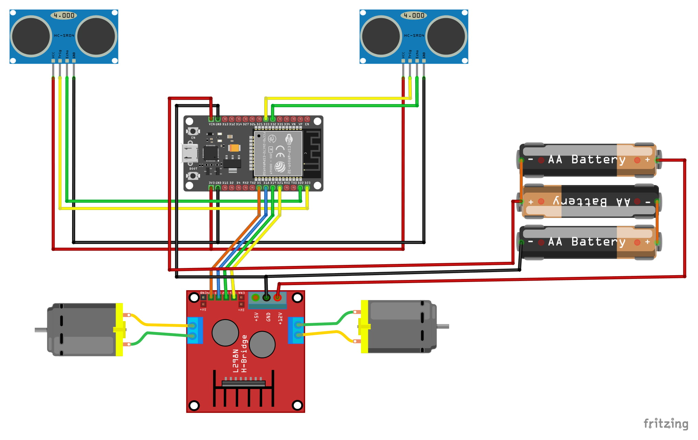

# Ambiente-de-programacao

Este é um projeto baseado no [BlocklyDuino](https://github.com/BlocklyDuino/BlocklyDuino)
no qual adicionamos a capacidade de programar um ESP32 via Wi-Fi.

O 'sistema' é baseado no IDF da Espressif para a compilação dos programas, junto com um script
feito pelo [Soneca](https://www.github.com/FranPedrosa) que é significativamente mais rápido na compilação dos
programas quando comparado à IDE do Arduino.

## Como Instalar e executar
### Este tutorial ensina a fazer a instalação em um sistema Ubuntu - testado no 18.04

- *clone* este repositório com

`git clone https://github.com/principia-robos-na-escola/Ambiente-de-programacao.git`

- O software de programação do ESP32 necessita da biblioteca python-serial. Instale-a com

`sudo apt install python-serial`

- Mude para o diretório 'BlocklySource'

`cd Ambiente-de-programacao/BlocklySource`

- Para executar o BlocklyDuino, use o comando

`python esp32_web_server.py`

**Obs:** Atualmente o padrão do Ubuntu tem python como *symlink* para o python2.
Caso haja algum erro após a execução desse último comando, pode ser que a sua versão do Ubuntu
tenha atualizado este *link* para python3. Re-execute o comando substituindo `python` por `python2`

## Exemplos de códigos para os Robozinhos

Alguns exemplos podem ser encontrado [neste repositório](https://www.github.com/principia-robos-na-escola/SoftwareESP32).

Em um dos [exemplos incluídos](https://github.com/principia-robos-na-escola/SoftwareESP32/blob/master/Anda-com-Sonar/RobotControlAndroidSonar2.ino),
o robô detecta obstáculos com o uso dos sonares e *tenta* desviar desses obstáculos.

O segundo exemplo permite o controle via Wi-Fi, usando um [aplicativo para celulares Android](https://github.com/simoesusp/Android_Remote_Control). O envio de comandos é feito via requisições GET,
logo podemos também controlar o robô via *web-browser* (não recomendamos, porém).

## Esquemático do Robozinho

